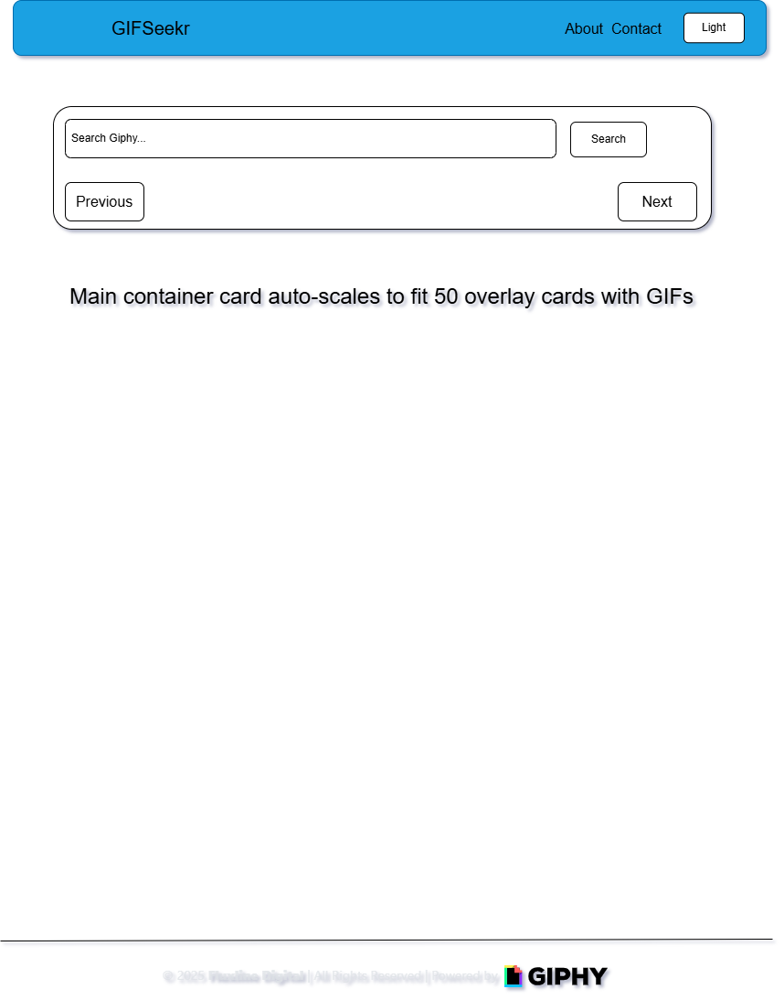
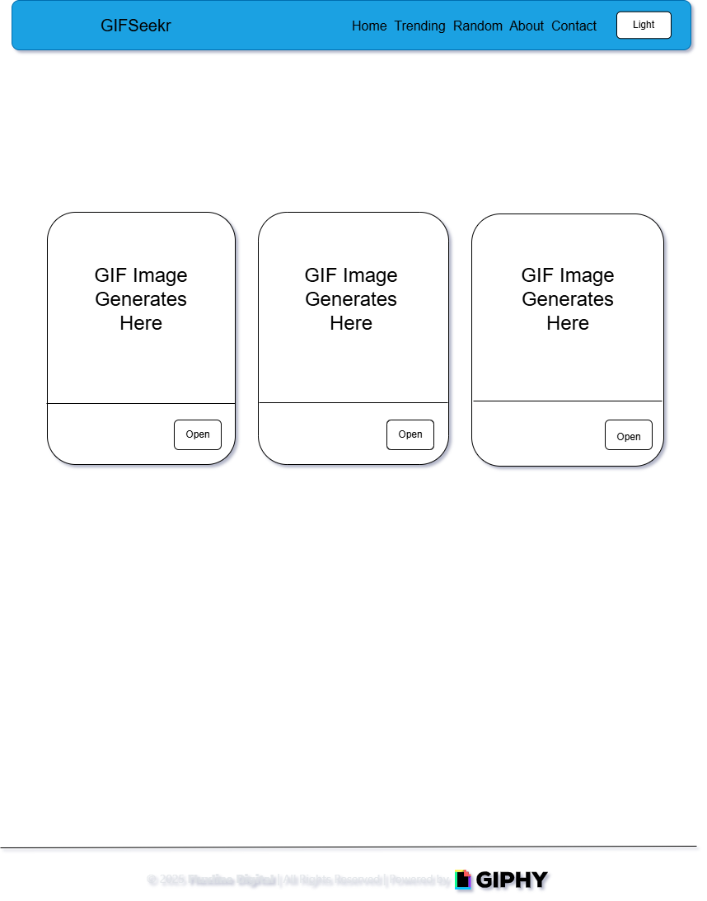
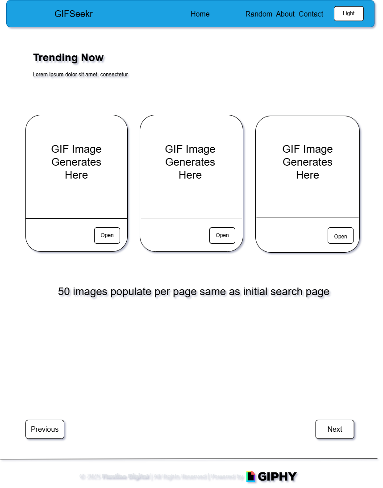
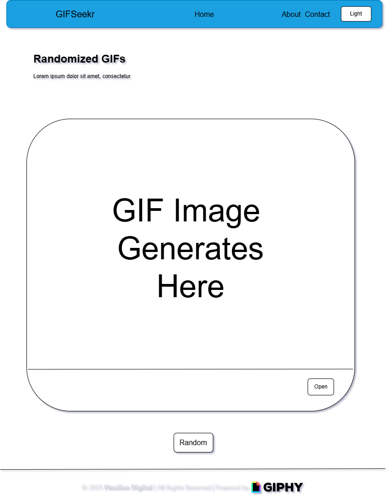
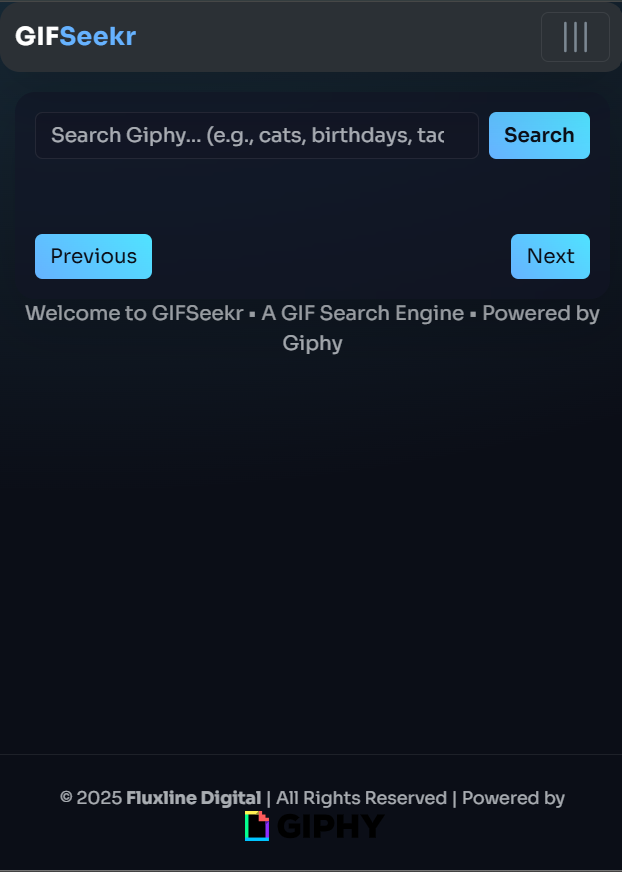
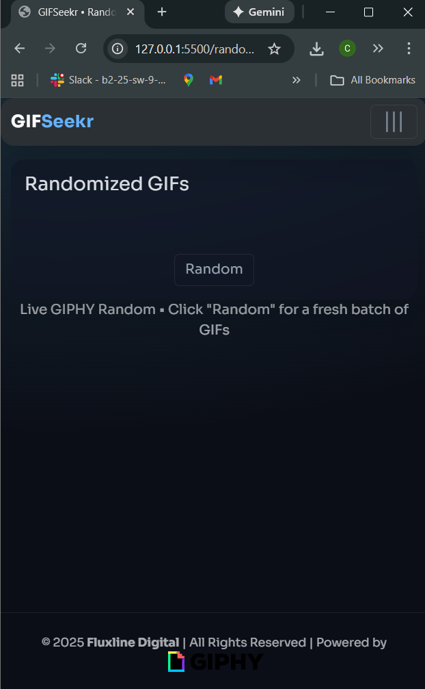
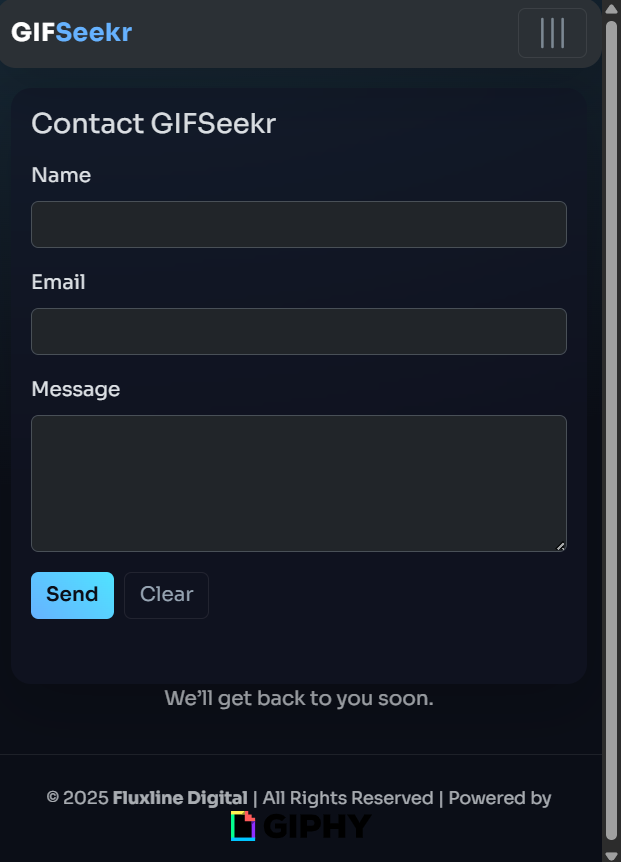

# GIFSeekr — A Giphy Search Engine

A sleek, professional Giphy search app with **true Light/Dark mode**, **glassmorphism**, **Bootstrap 5.3.8** polish, and a **custom flex grid**. Includes **SASS** for extra credit. Emphasizes a custom grid, responsiveness (desktop and ≤320px), and separate files.

## Features

- Search form (type=search) + button
- Fetches Giphy **Search Endpoint** and renders results as cards
- **Custom flex grid** (`.grid` + `.col`) — not Bootstrap’s grid
- **Light/Dark mode** toggle; also respects `prefers-color-scheme`
- **Glassmorphism** card wrapper
- Mobile-first with ≤320px stacking per spec

## Getting Started

1. Open `main.js` and set API key:
   ```js
   const API_KEY = 'REPLACE_WITH_GIPHY_API_KEY';
   ```

## Tech Stack

HTML, CSS, SCSS (extra credit), JavaScript
Bootstrap 5.3.8 (CDN) for base styles/components
Google Fonts (..)

## Structure

project-root/
│
├── index.html
├── CSS/
│ └── style.css
│ └── style.scss
├── JS/
│ └── main.js
└── Images/
└── image.png

## How to Use

Enter a term and click Search.
Click Open on any card to view the GIF at Giphy.com

## Ideas for Future Improvement

1. Pagination / infinite scroll
2. Filters: rating, type, stickers vs gifs
3. Saved searches & favorites
4. Skeleton loaders and retry

## User Stories

1. Searching GIFs

🧑‍💻 As a GIF-hunter,
I want to type in a keyword and instantly see a grid of matching GIFs
So that I can find the perfect reaction image without scrolling for ages.

2. Viewing Trending Content

🔥 As a bored student,
I want to browse the current trending GIFs
So that I can see what the world is laughing at today.

3. Viewing a Single Random GIF

🎲 As a chaotic soul,
I want to smash a Random button
So that destiny picks a GIF for me because choices are hard.

## Wire Frames







## View Site

   







\*_Thank you for reading and showing interest_
